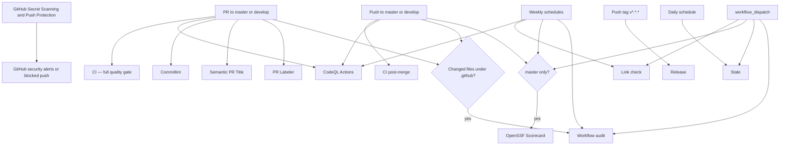
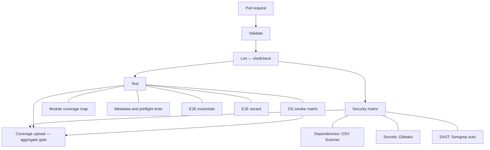

# GitHub Actions workflow flow

This document describes the workflows in `.github/workflows/`.
Most jobs run on GitHub-hosted `ubuntu-latest`; OS smoke jobs use Ubuntu,
Debian, and Rocky Linux Docker images, with the ARM64 leg using an
`ubuntu-24.04-arm` runner.
E2E suites use Docker (DinD-capable privileged containers) via `tests/run_e2e.sh`.

## Overall event flow

## Pull-request gate (`ci.yml`)

**Trigger:** pull requests targeting `master` or `develop`.

Final required-style job name: **Coverage upload** (aggregates Validate → Lint → Security → Test → OS smoke matrix).
There is no Codecov/Sonar upload for this Bash project — omit those README badges until configured.

Dependency Review Action is not used (needs Dependency graph / GHAS support); OSV covers the Dependencies security leg.

Local full matrix: `make e2e` (all suites). CI runs the Ubuntu full essentials/wizard gate plus Debian/Rocky/ARM64 essentials smoke coverage.

## Post-merge (`ci-post-merge.yml`)

Push to `master` / `develop`: syntax check → shellcheck → coverage map → essentials E2E.

## Policy workflows

| Workflow | Job name | Role |
| --- | --- | --- |
| `commitlint.yml` | Validate commit messages | Conventional Commits on PR commits |
| `semantic-pr.yml` | Validate PR Title | Type + uppercase subject |
| `codeql.yml` | Analyze GitHub Actions | Actions language |
| `workflow-audit.yml` | Actionlint / Zizmor | When `.github/**` changes |
| `scorecard.yml` | Scorecard Analysis | OpenSSF |
| `pr-labeler.yml` | Auto-label PR | Path labels |
| `stale.yml` | Mark stale | Issues/PRs |
| `link-check.yml` | Check Markdown links | Weekly lychee |
| `release.yml` | Release | Tag `v*.*.*` on master |

## Dependabot

Weekly `github-actions` updates (`ci` conventional prefix).
